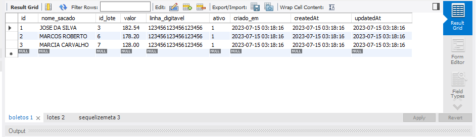
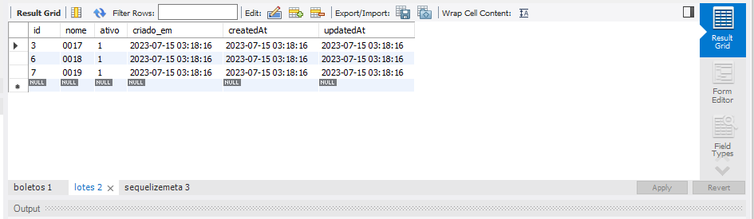
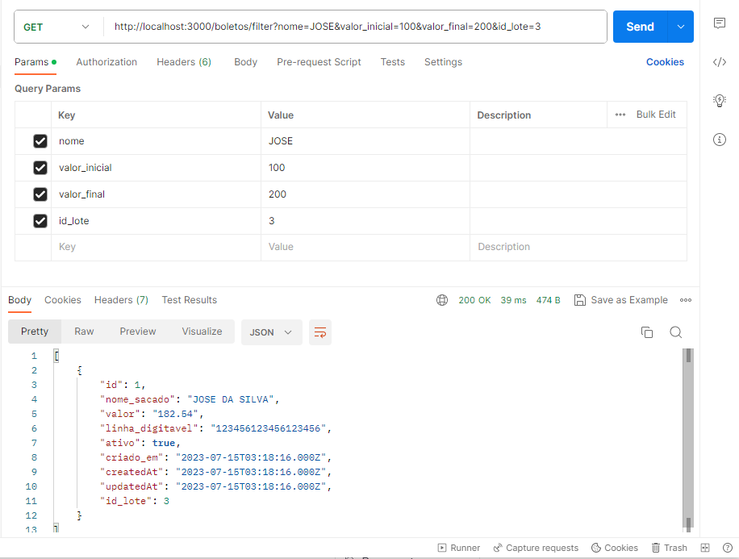
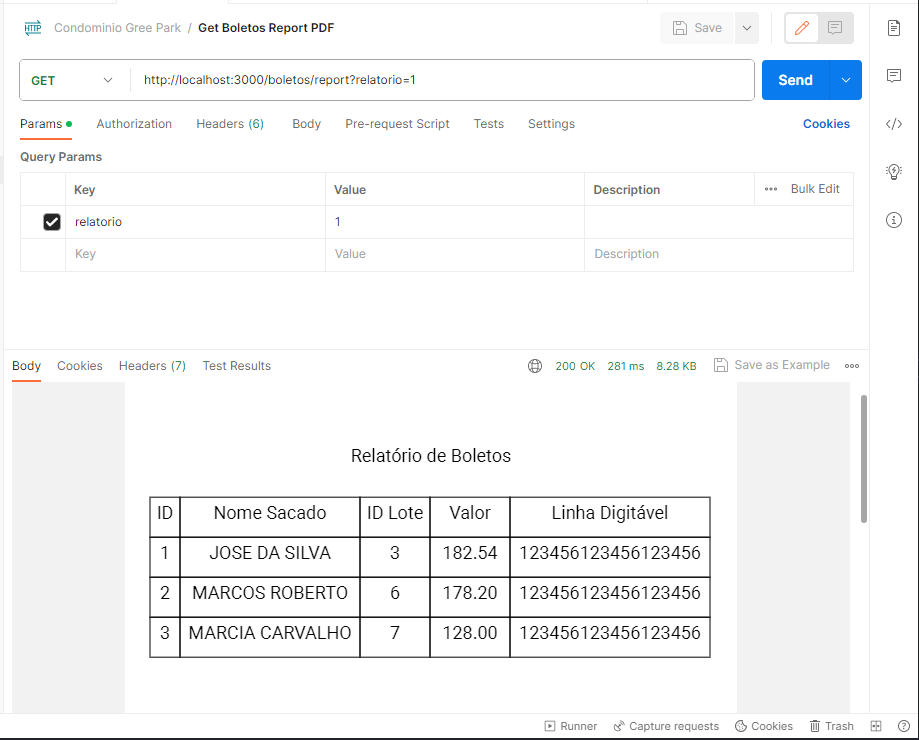

# Projeto NodeJS - Desafio Técnico Backend

Este projeto é uma aplicação NodeJS desenvolvida para atender o desafio técnico de backend da Green Acesso. O objetivo do projeto é importar arquivos CSV e PDF, realizar operações de mapeamento e exportação de boletos em PDF, e fornecer endpoints para consulta e geração de relatórios.

## Características do Projeto

- Desenvolvido em NodeJS
- Utiliza banco de dados SQL (MySQL neste exemplo)
- Utiliza o framework Express
- Utiliza o ORM Sequelize para mapeamento objeto-relacional
- Manipulação de arquivos CSV e PDF

## Etapa 1: Entendendo o Problema

<div align=center>
    <h3>Condomínio Green Park</h3>
    
</div>

O cenário do problema envolve um condomínio chamado Condomínio Green Park, que utiliza dois aplicativos: um para controle de acesso da portaria e outro para gerenciamento das taxas condominiais do financeiro. O síndico decidiu exportar os boletos do financeiro e importá-los no aplicativo da portaria.

O projeto consiste em criar um endpoint para importar arquivos CSV contendo dados dos boletos e realizar o mapeamento dos boletos com os lotes correspondentes no sistema. Além disso, é necessário receber um arquivo PDF contendo os boletos em uma ordem específica, dividir o PDF em arquivos individuais por boleto e salvá-los em uma pasta no sistema. Por fim, é necessário implementar endpoints para consultar os boletos e gerar um relatório em PDF.

## Etapa 2: Funcionalidades do Projeto

### Atividade 1: Importação de Arquivo CSV

O endpoint desenvolvido permite a importação de um arquivo CSV contendo informações dos boletos. Os dados são extraídos do arquivo e salvos na tabela "boletos" do banco de dados.

### Atividade 2: Mapeamento dos Boletos

O sistema externo fornece o nome da unidade (lote) no formato utilizado por eles, enquanto o sistema interno utiliza o nome do lote em um formato diferente. É necessário fazer o mapeamento entre os dois sistemas para descobrir o ID do lote no sistema interno e associá-lo aos boletos importados.

<div align=center>
    <h3>Boletos</h3>
    
</div>
<div align=center>
    <h3>Lotes</h3>
    
</div>

### Atividade 3: Exportação de Boletos em PDF

O endpoint recebe um arquivo PDF contendo os boletos em uma ordem fixa. Os boletos são desmembrados em arquivos individuais por boleto e salvos em uma pasta local. Cada arquivo é nomeado com o ID correspondente ao boleto na tabela "boletos".

*OBS*: Os arquivos estão na pasta uplouds na raiz do projeto.

### Atividade 4: Consulta de Boletos

O projeto possui um endpoint para consultar os boletos existentes no sistema. É possível realizar filtros por nome, faixa de valores e ID do lote.

<div align=center>
    <h3>Filter</h3>
    
</div>

### Atividade 5: Geração de Relatório em PDF

O endpoint de relatório permite a geração de um arquivo PDF contendo um relatório dos boletos. O PDF é composto por uma tabela com os dados dos boletos solicitados.

<div align=center>
    <h3>Relatório Base64</h3>
    
</div>

## Etapa 3: Como Iniciar o Projeto

Para iniciar o projeto, siga os passos abaixo:

1. Certifique-se de ter o Node.js instalado em sua máquina.
2. Faça o download ou clone este repositório.
3. No diretório raiz do projeto, execute o seguinte comando para instalar as dependências:

   ```
   npm install
   ```

4. Certifique-se de ter um banco de dados MySQL configurado e atualize as informações de conexão no arquivo `.env`.
5. Execute as migrações do Sequelize para criar as tabelas no banco de dados:

   ```
   npm run migrate
   ```

6. Inicie o servidor:

   ```
   npm start
   ```

7. O servidor estará em execução na porta especificada no arquivo `.env`. Você pode acessar os endpoints do projeto usando uma ferramenta como o Postman.

- *OBS*: A Collection está na pasta docs em src/assets.

8. Todos Endpoints do projeto:

- Importar boletos a partir de um arquivo CSV:
   - **Método:** POST
   - **Rota:** `/boletos/import`
   - **Descrição:** Recebe um arquivo CSV contendo os boletos e realiza a importação para o sistema.

- Importar boletos a partir de um arquivo PDF:
    - **Método:** POST
    - **Rota:** `/boletos/import/pdf`
    - **Descrição:** Recebe um arquivo PDF contendo os boletos e realiza a importação para o sistema.
    - *OBS*: Esse endpoint permite a importação de boletos a partir de um arquivo PDF, assim como o endpoint /boletos/import permite a importação a partir de um arquivo CSV.

- Obter todos os boletos:
   - **Método:** GET
   - **Rota:** `/boletos`
   - **Descrição:** Retorna todos os boletos cadastrados no sistema.

- Obter boletos com filtros:
   - **Método:** GET
   - **Rota:** `/boletos/filter`
   - **Descrição:** Retorna os boletos filtrados com base nos parâmetros informados.
   - **Parâmetros de consulta:** `nome` (nome do sacado), `valor_inicial` (valor mínimo), `valor_final` (valor máximo) e `id_lote` (ID do lote).
   - **Exemplo:**
        ```
        http://localhost:3000/boletos/filter?nome=JOSE&valor_inicial=100&valor_final=200&id_lote=3
        ```

- Gerar relatório de boletos em PDF:
   - **Método:** GET
   - **Rota:** `/boletos/report`
   - **Descrição:** Gera um relatório em formato PDF contendo uma tabela com os boletos cadastrados no sistema.
   - **Parâmetros de consulta:** `relatorio=1` (para solicitar o relatório).

## Dependências

O projeto utiliza as seguintes dependências:

- csv-parser: Biblioteca para análise de arquivos CSV.
- dotenv: Biblioteca para carregar variáveis de ambiente a partir de um arquivo .env.
- express: Framework web utilizado para criar os endpoints da aplicação.
- multer: Middleware para lidar com o upload de arquivos.
- mysql2: Pacote para conexão e manipulação de banco de dados MySQL.
- pdfkit: Biblioteca para criação e manipulação de arquivos PDF.
- sequelize: ORM utilizado para mapeamento objeto-relacional.
- sequelize-cli: CLI do Sequelize para executar migrações e comandos do banco de dados.

## Considerações Finais

Este projeto é uma solução para o desafio técnico backend da Green Acesso. Ele abrange as principais funcionalidades solicitadas e foi desenvolvido utilizando as tecnologias NodeJS, Express, Sequelize e outras bibliotecas relevantes.

Caso haja alguma dúvida ou problema durante a execução do projeto, não hesite em entrar em contato.

Aproveite o projeto e divirta-se explorando suas funcionalidades!